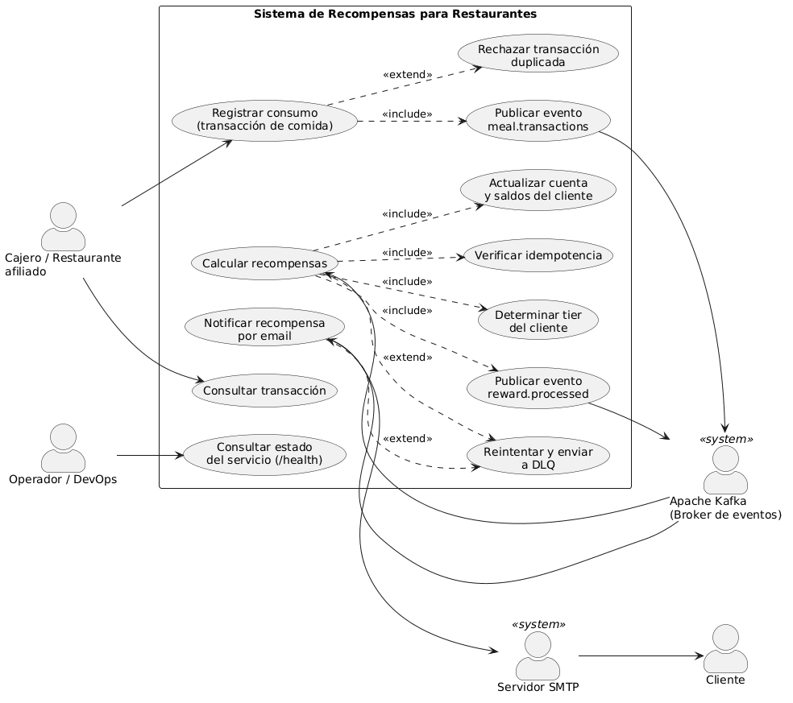

# Sistema de Recompensas para Restaurantes

Sistema de fidelización basado en arquitectura orientada a eventos (EDA) con Apache Kafka. Cuando un cliente consume en un restaurante afiliado, el sistema registra la transacción, calcula sus recompensas automáticamente y notifica al cliente por correo electrónico.

**Curso:** CS3081 – Ingeniería de Software | UTEC  
**Cobertura de pruebas:** 99.1% | **Tests:** 150 | **Líneas duplicadas:** < 2%

---

## Casos de Uso



---

## Arquitectura

```
Cliente HTTP
     │
     ▼
┌─────────────────────┐
│  restaurant_service  │  FastAPI  :8000
│  POST /api/v1/meals  │  Registra transacciones
└──────────┬──────────┘
           │ publica evento
           ▼
    ┌─────────────┐
    │    Kafka    │  meal.transactions
    └──────┬──────┘
           │ consume
           ▼
┌─────────────────────┐
│   rewards_service   │  Consumer + FastAPI :8001
│  Calcula recompensas │  Persiste en SQLite
└──────────┬──────────┘
           │ publica evento
           ▼
    ┌─────────────┐
    │    Kafka    │  reward.processed
    └──────┬──────┘
           │ consume
           ▼
┌─────────────────────┐
│ notification_service │  Consumer + FastAPI :8002
│  Envía email SMTP    │  Confirma recompensa
└─────────────────────┘
```

### Patrón: Arquitectura Hexagonal (Ports & Adapters)

Cada microservicio está organizado en tres capas sin dependencias cruzadas:

| Capa | Contenido | Dependencias |
|---|---|---|
| **Domain** | Entidades, puertos (ABC), reglas de negocio | Ninguna |
| **Application** | Casos de uso | Solo domain |
| **Infrastructure** | Kafka, SQLAlchemy, SMTP, FastAPI | Domain + Application |

---

## Microservicios

### `restaurant_service` — Productor
Expone una API REST para registrar consumos en restaurantes. Publica un `MealTransactionEvent` a Kafka por cada transacción registrada.

**Endpoints:**
- `POST /api/v1/meals` — Registra una transacción
- `GET /api/v1/meals/{transaction_id}` — Consulta una transacción
- `GET /health` — Estado del servicio

**Payload de registro:**
```json
{
  "card_number": "4532-XXXX-XXXX-1234",
  "restaurant_code": "REST-001",
  "amount": 150.00,
  "customer_email": "cliente@ejemplo.com"
}
```

### `rewards_service` — Procesador de Recompensas
Consume `meal.transactions`, calcula puntos y cashback según el tier del cliente, y persiste en SQLite. Publica un `RewardProcessedEvent` al terminar.

**Reglas de negocio:**

| Tier | Monto (PEN) | Puntos/PEN | Cashback |
|---|---|---|---|
| Standard | 0 – 49.99 | 0.5 pts | 2.5% |
| Silver | 50 – 149.99 | 1.0 pts | 3.0% |
| Gold | 150 – 299.99 | 1.5 pts | 4.0% |
| Platinum | 300+ | 2.0 pts | 5.0% |

### `notification_service` — Notificaciones por Email
Consume `reward.processed` y envía un correo HTML al cliente confirmando sus recompensas acreditadas.

---

## Kafka Topics

| Topic | Productor | Consumidor | Descripción |
|---|---|---|---|
| `meal.transactions` | restaurant_service | rewards_service | Cena registrada |
| `reward.processed` | rewards_service | notification_service | Recompensa calculada |
| `meal.transactions.dlq` | rewards_service | — | Mensajes fallidos (DLQ) |

**Broker externo:** `213.199.42.57:9092`

---

## Estructura del Proyecto

```
Tarea8-IngSoftware/
├── shared/                      # Contratos compartidos
│   ├── events/schemas.py        # Pydantic v2: MealTransactionEvent, RewardProcessedEvent, DLQEvent
│   ├── kafka/
│   │   ├── base_producer.py     # BaseKafkaProducer (ABC) con retry de entrega
│   │   └── base_consumer.py     # BaseKafkaConsumer (ABC) con retry + DLQ
│   └── config.py                # KafkaConfig, SMTPConfig via pydantic-settings
│
├── restaurant_service/
│   ├── domain/                  # MealTransaction, puertos
│   ├── application/             # RegisterMealUseCase
│   ├── infrastructure/          # FastAPI router, Kafka producer, repositorio en memoria
│   └── tests/                   # unit/, whitebox/, e2e/
│
├── rewards_service/
│   ├── domain/                  # CustomerAccount, RewardCalculator (lógica pura)
│   ├── application/             # ProcessMealEventUseCase (con idempotencia)
│   ├── infrastructure/          # SQLAlchemy, Kafka consumer/producer
│   └── tests/                   # unit/, whitebox/, integration/
│
├── notification_service/
│   ├── domain/                  # NotificationRequest, IEmailSender
│   ├── application/             # SendRewardNotificationUseCase
│   ├── infrastructure/          # SMTPEmailSender (STARTTLS), Kafka consumer
│   └── tests/                   # unit/, whitebox/
│
├── tests/
│   ├── e2e/test_full_flow.py    # Flujo completo API → Kafka → rewards → email
│   └── performance/locustfile.py # 100 usuarios concurrentes con Locust
│
├── docker-compose.yml
├── pytest.ini
├── .coveragerc
└── sonar-project.properties
```

---

## Alta Disponibilidad

- **Manual commit Kafka** — `enable.auto.commit=False`: el offset se confirma solo tras procesar exitosamente (at-least-once delivery).
- **Retry con backoff exponencial** — 3 intentos: 500ms → 1s → 2s. Tras agotar intentos, el mensaje va al DLQ.
- **Dead Letter Queue** — mensajes irrecuperables en `<topic>.dlq` sin bloquear el flujo principal.
- **Consumer Groups** — `group.id` único por servicio, 3 particiones permiten escalar horizontalmente.
- **Health endpoints** — `GET /health` en cada servicio para monitoreo.

---

## Pruebas

| Tipo | Cantidad | Descripción |
|---|---|---|
| Unitarias | 50+ | Dominio y casos de uso con mocks |
| Caja blanca | 25+ | Branch coverage: tiers, límites, errores |
| Integración | 9 | Repositorio SQLite in-memory |
| E2E | 14 | API → Kafka mock → rewards → email mock |
| Performance | — | Locust: 100 usuarios concurrentes |

**Cobertura total: 99.1%**

---

## Instalación y Ejecución

### Requisitos
- Python 3.11+
- Acceso al broker Kafka en `213.199.42.57:9092`

### Setup local

```bash
# Crear entorno virtual e instalar dependencias
python3 -m venv .venv
source .venv/bin/activate
pip install -r requirements.txt \
            -r restaurant_service/requirements.txt \
            -r rewards_service/requirements.txt \
            -r notification_service/requirements.txt

# Copiar y configurar variables de entorno
cp .env.example .env
# Editar .env con credenciales SMTP reales
```

### Ejecutar pruebas

```bash
# Suite completa con cobertura
PYTHONPATH=. pytest

# Solo tests unitarios (sin cobertura, más rápido)
PYTHONPATH=. pytest --no-cov -q

# Tests de performance (requiere el servicio corriendo en :8000)
locust -f tests/performance/locustfile.py --headless -u 100 -r 10 --run-time 60s --host http://localhost:8000
```

### Ejecutar con Docker

```bash
# Copiar .env
cp .env.example .env

# Levantar los tres microservicios
docker compose up --build

# Verificar estado de cada servicio
curl http://localhost:8000/health   # restaurant_service
curl http://localhost:8001/health   # rewards_service
curl http://localhost:8002/health   # notification_service
```

### Probar manualmente

```bash
# Registrar una cena
curl -X POST http://localhost:8000/api/v1/meals \
  -H "Content-Type: application/json" \
  -d '{
    "card_number": "4532-TEST-1234",
    "restaurant_code": "REST-001",
    "amount": 200.00,
    "customer_email": "cliente@ejemplo.com"
  }'

# Respuesta esperada (HTTP 201)
{
  "transaction_id": "550e8400-...",
  "card_number": "4532-TEST-1234",
  "restaurant_code": "REST-001",
  "amount": "200.00",
  "currency": "PEN",
  "timestamp": "2026-05-29T14:30:00Z"
}
```

---

## Análisis Estático (SonarCloud)

El proyecto está configurado en `sonar-project.properties` con el proyecto `Yeimi_Varela_t1`.

```bash
# Generar reporte de cobertura y enviar a SonarCloud
PYTHONPATH=. pytest --cov-report=xml:coverage.xml
sonar-scanner
```

---

## Variables de Entorno

| Variable | Descripción | Default |
|---|---|---|
| `KAFKA_BOOTSTRAP_SERVERS` | Dirección del broker Kafka | `213.199.42.57:9092` |
| `SMTP_HOST` | Host del servidor SMTP | `smtp.gmail.com` |
| `SMTP_PORT` | Puerto SMTP | `587` |
| `SMTP_USER` | Usuario SMTP | — |
| `SMTP_PASSWORD` | Contraseña / App Password | — |
| `SMTP_FROM` | Dirección de remitente | `rewards@restaurant.com` |
| `DATABASE_URL` | URL de SQLite | `sqlite:///./data/rewards.db` |
| `LOG_LEVEL` | Nivel de logging | `DEBUG` |
